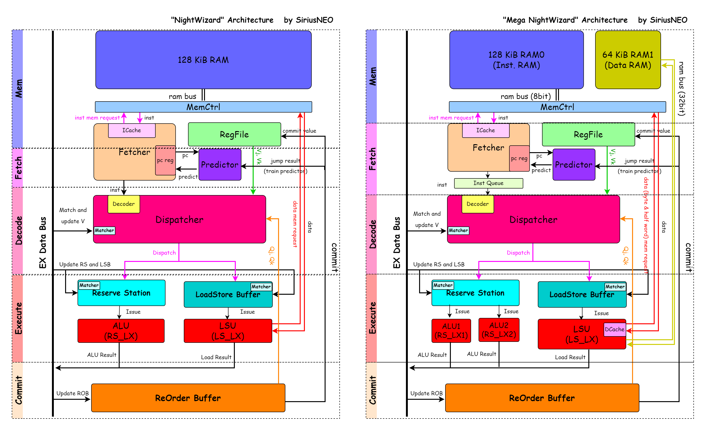

# NightWizard

	

CS2951-1 Architecture Assignment, A Verilog HDL implemented RISC-V CPU.

Running on Basys3 FPGA Board (XC7A35T-ICPG236C) with all testcases passed.

    

### Versions

- NightWizard (my stable version)

  | Feature            | Detail                                                       |
  | ------------------ | ------------------------------------------------------------ |
  | Dynamic Scheduling | Tomasulo algorithm with 16 entries RS, 16 entries LSB, 16 entries ROB |
  | Cache              | 256 entries I-Cache                                          |
  | Prediction         | 256 entries 2-bit saturated counter history table            |
  | Clock Rate         | 80~100MHz, with wns -1.9 in 100MHz                           |
  | Performance        | with `pi.c` passed in `1.6s` averagely                       |
  | Ram                | 128 KiB BRAM (total: 32/50)                                  |

- Mega NightWizard (an experimental trial)

  | Feature            | Detail                                                       |
  | ------------------ | ------------------------------------------------------------ |
  | Dynamic Scheduling | Tomasulo algorithm with 16 entries RS, 16 entries LSB, 16 entries ROB |
  | Cache              | 256 entries I-Cache                                          |
  | Prediction         | 256 entries 2-bit saturated counter history table            |
  | Clock Rate         | 80~100MHz, with wns -2.0 in 100MHz                           |
  | Performance        | with `pi.c` passed in `1.4s` averagely（there are some testcases more suitable for MegaWizard） |
  | Ram                | Harvard Architecture: 128 KiB Inst & BSS BRAM (i.e. ram0) and 64 KiB Data BRAM (i.e. ram1)  (total: 48/50) |
  | RAM Bus Design     | 8 bit width for ram0, 32 bit width for ram1                  |
  | Superscalar        | RS issues two instructions to two ALUs parallelly            |

### Design

(warning: some units were removed. see `Backup`.)

See:

- [NightWizard](doc/NightWizard.png)

- [Mega NightWizard](doc/MegaWizard.png)

### Backup

Some units I do not add into my final version for some reasons:

| Units                               | Shortage                                                     |
| ----------------------------------- | ------------------------------------------------------------ |
| Instruction Queue                   | Maybe helpful if I have multiple decoders, but with iCache it does little help |
| Directly Mapped D-Cache             | Not efficient as I expected                                  |
| Two-Level Adaptive Branch Predictor | Efficient (in simulation) but take too many resources, hard to synthesis |

### Other Docs

- [Versions Info and Performance](doc/Version.md)
- [Tutorial of this homework](doc/Tutorial.md)

### References

- The RISC-V Instruction Set Manual (riscv-spec)
- RISC-V-Reader-Chinese
- riscv-boom https://docs.boom-core.org/en/latest/index.html
- Computer Architecture A Quantitative Approach,  *John L Hennessy & David A Patterson*
- https://github.com/ZYHowell/YPU